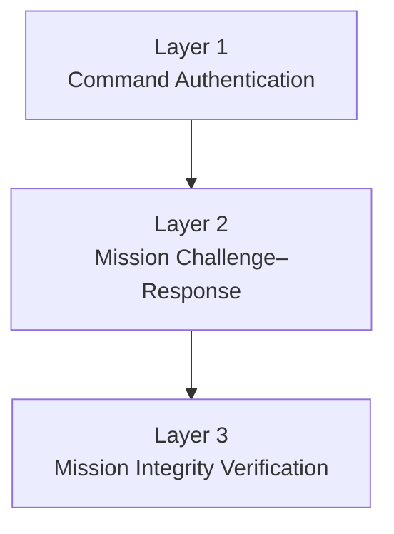
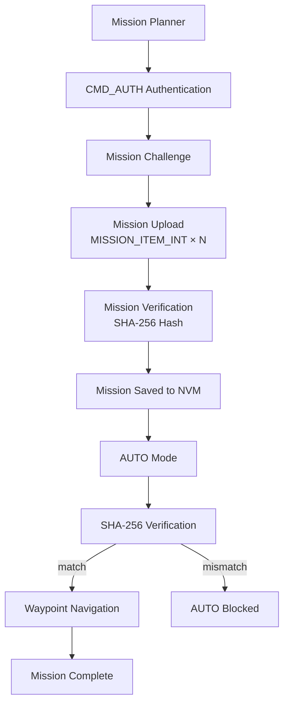

# Vega-FC v2 — RISC-V Flight Controller Firmware

[](LICENSE)


A bare-metal MAVLink v2 flight controller firmware for the **VEGA/THEJAS32 RISC-V platform** with Mission Planner interoperability and a lightweight three-layer mission security framework.

---

## Table of Contents

1. [Project Overview](#project-overview)
2. [Features](#features)
3. [System Architecture](#system-architecture)
4. [Security Architecture](#security-architecture)
5. [Mission Execution Flow](#mission-execution-flow)
6. [Experimental Results](#experimental-results)
7. [Future Work](#future-work)
8. [Prerequisites](#prerequisites)
9. [Toolchain Installation](#toolchain-installation)
10. [Build Instructions](#build-instructions)
11. [Project Structure](#project-structure)
12. [Code Overview](#code-overview)
13. [Testing with QEMU + Mission Planner](#testing-with-qemu--mission-planner)
14. [Common Issues](#common-issues)
15. [Toolchain Details](#toolchain-details)

---

## Project Overview

Vega-FC v2 is a bare-metal flight controller firmware for the **Vega Thejas (32-bit RISC-V)** processor, communicating via **MAVLink v2** protocol. The firmware supports telemetry transmission, ARM/DISARM, flight mode switching (STABILIZE, AUTO, GUIDED, LOITER, RTL), mission upload/download/clear, waypoint navigation with proportional control, autonomous mission execution, GUIDED click-to-fly, battery simulation, failsafe logic, mission persistence, configurable parameters, and a three-layer mission security framework.

The entire firmware runs with no RTOS, no libc, no FPU, and no heap — all memory is statically allocated and all floating-point operations are emulated via IEEE754 integer bit manipulation and lookup tables.

---

## Features

### Communication

| Feature | Description |
|---------|-------------|
| MAVLink v2 | Full protocol stack over UART (16550-compatible at 0x10000000) |
| Bidirectional | Mission Planner / QGroundControl interoperability |
| HEARTBEAT | Vehicle type (quadrotor), armed state, flight mode — 500ms |
| ATTITUDE | Roll, pitch, yaw with heading from navigation — 100ms |
| SYS_STATUS | Battery voltage, current, remaining % (dynamic) — 1000ms |
| VFR_HUD | Airspeed, groundspeed, heading, throttle, altitude — 200ms |
| GPS_RAW_INT | GPS position, fix type, satellites visible — 1000ms |
| GLOBAL_POSITION_INT | Global position with heading — 1000ms |
| NAV_CONTROLLER_OUTPUT | Distance-to-waypoint (meters), target bearing — 200ms |
| PARAM protocol | Read/write/list 11 parameters including WP_RADIUS and security params |
| COMMAND_LONG | ARM/DISARM, mode change, set home, parameter operations |

### Mission Features

| Feature | Description |
|---------|-------------|
| Mission Upload | Full protocol: MISSION_COUNT → MISSION_ITEM_INT → MISSION_ACK (up to 20 waypoints) |
| Mission Download | Responds to MISSION_REQUEST_LIST, MISSION_REQUEST_INT, MISSION_REQUEST |
| Waypoint Navigation | Bearing-based proportional control with smooth diagonal flight |
| Mission Current | Sends MISSION_CURRENT during waypoint navigation |
| Mission Complete | Sends "MISSION COMPLETE" STATUSTEXT on final waypoint reached |
| AUTO Mode | Autonomous waypoint navigation with configurable acceptance radius |
| GUIDED Mode | Click-to-fly via SET_POSITION_TARGET_GLOBAL_INT |
| RTL Mode | Autonomous return-to-home navigation |

### Security Features

**Layer 1 — Session-Based Command Authentication**
- Dynamic `CMD_AUTH` token generated on every firmware boot
- Previous session tokens rejected
- Guards ARM/DISARM, mode changes, set home, mission upload/clear

**Layer 2 — Session-Based Mission Challenge–Response**
- Dynamic `MISSION_CHALLENGE` generated during firmware startup
- Mission upload authorized only after valid challenge response
- Previous session responses rejected

**Layer 3 — Mission Integrity Verification**
- SHA-256 mission hash generation after successful upload
- Mission hash stored in firmware non-volatile memory
- Mission hash verified before AUTO mode execution
- AUTO mission blocked if hash verification fails

### Additional Capabilities

- **Battery Simulation**: Dynamic discharge model, voltage scaling, real-time reporting
- **Failsafe Logic**: Low battery → RTL, GPS loss → LOITER with priority handling
- **Mission Persistence**: Auto-save on upload, restore on boot, simulated NVM via linker `.nvm` section
- **Simulated Vehicle Movement**: Position updated with smooth proportional control, GPS satellite fluctuation
- **Bare-Metal Architecture**: No RTOS, no libc, no FPU, no heap — ~31KB total footprint
- **Configurable Parameters**: 11 tunable parameters including WP_RADIUS (3-500m)

---

## System Architecture

```mermaid
flowchart TD
    MP[Mission Planner / GCS]
    TCP[TCP / UART]
    MV2[MAVLink v2]
    FC[VEGA Bare-Metal Firmware]
    SCH[Cooperative Scheduler<br/>1ms tick]
    MM[Mission Manager]
    SEC[Security Framework]
    NE[Navigation Engine]
    SIM[Simulation Engine]
    NVM[Simulated NVM<br/>(.nvm section)]

    MP --> TCP
    TCP --> MV2
    MV2 --> FC
    FC --> SCH
    SCH --> MM
    MM --> SEC
    SEC --> NE
    NE --> SIM
    MM <--> NVM
```

### Main Loop

```mermaid
flowchart LR
    WFI[Wait For Interrupt<br/>(WFI)] --> SCHED[scheduler_run()]
    SCHED --> RX[mavlink_rx_poll()]
    RX --> WFI
```

The cooperative scheduler runs 10 periodic tasks driven by a 1ms hardware timer tick (`MTIMER`):

| Task | Period | Description |
|------|--------|-------------|
| `send_heartbeat` | 500 ms | Vehicle type, armed state, flight mode |
| `send_attitude` | 100 ms | Simulated roll/pitch, actual heading |
| `mission_update` | 100 ms | Waypoint navigation, GUIDED click-to-fly, RTL |
| `sim_battery_update` | 100 ms | Battery drain, GPS satellite simulation |
| `failsafe_check` | 100 ms | Low battery → RTL, GPS loss → LOITER |
| `send_vfr_hud` | 200 ms | Airspeed, altitude, heading, throttle |
| `send_nav_controller_output` | 200 ms | Distance-to-waypoint, target bearing, heading |
| `send_sys_status` | 1000 ms | Battery voltage, current, remaining % |
| `send_gps_raw_int` | 1000 ms | GPS position, fix type, satellites |
| `send_global_position_int` | 1000 ms | Global position with heading |

---

## Security Architecture

The firmware implements a three-layer security framework that protects the flight controller from unauthorized access and ensures mission integrity.



### Layer 1 — Session-Based Command Authentication

**Purpose**: Protect sensitive commands such as ARM/DISARM and mode changes.

**How it works**:
1. On every firmware boot, a session-specific authentication token is generated using XOR-shift PRNG:
   ```c
   uint32_t x = seed;
   x ^= x << 13; x ^= x >> 17; x ^= x << 5;
   uint32_t token = (x % 10000); // 0..9999
   current_cmd_auth_token = token;
   ```
2. The token is published as the `CMD_AUTH` parameter so the GCS can read it
3. When the GCS sends a secure command, the firmware reads the `CMD_AUTH` parameter value and compares it against the session token
4. On mismatch, the command is rejected with `MAV_RESULT_DENIED` and "CMD AUTH FAIL" STATUSTEXT
5. Authentication latency is measured and reported

**Protected commands**: ARM/DISARM (`MAV_CMD_COMPONENT_ARM_DISARM`), mode changes (`MAV_CMD_DO_SET_MODE`), set home (`MAV_CMD_DO_SET_HOME`), mission upload (`MISSION_COUNT`, `MISSION_ITEM_INT`, `MISSION_ITEM`), mission clear (`MISSION_CLEAR_ALL`)

### Layer 2 — Mission Challenge–Response

**Purpose**: Authenticate mission uploads before accepting waypoint data.

**How it works**:
1. GCS sets `MISSION_ID` and `MISSION_VER` parameters before upload
2. GCS sends `MISSION_COUNT` — firmware validates metadata, generates a pseudo-random challenge value
3. Challenge is published as the `MISSION_CHALLENGE` parameter
4. GCS must respond by setting `MISSION_CHAL_RESP` to the same value
5. Waypoint data (MISSION_ITEM_INT / MISSION_ITEM) is only accepted after successful challenge response
6. Without authorization, firmware responds with `MAV_MISSION_DENIED`

### Layer 3 — Mission Integrity Verification

**Purpose**: Ensure that uploaded missions have not been modified before execution.

**How it works**:
1. After successful mission upload, SHA-256 hash is computed over all waypoint data (lat, lon, alt, command)
2. Hash is stored in firmware non-volatile memory alongside the waypoints
3. On AUTO mode entry, the hash is recomputed from the current mission data and compared against the stored hash
4. On match: mission execution proceeds — "MISSION HASH VERIFIED" / "MISSION INTEGRITY VERIFIED" / "AUTO MODE ENABLED"
5. On mismatch: AUTO mode is blocked — "MISSION HASH MISMATCH" / "MISSION TAMPERED" / forced STABILIZE mode

---

## Mission Execution Flow



### Detailed Step-by-Step

1. **Pre-flight Setup**: GCS runs `set_msig_and_auth.py` to set `CMD_AUTH`, `MISSION_ID`, `MISSION_VER` parameters
2. **Command Authentication**: GCS sets `CMD_AUTH = <session_token>` via PARAM_SET
3. **Mission Challenge**: GCS sends MISSION_COUNT → firmware validates metadata, generates challenge → publishes MISSION_CHALLENGE
4. **Challenge Response**: GCS reads MISSION_CHALLENGE, sets MISSION_CHAL_RESP to match → firmware authorizes upload
5. **Mission Upload**: Firmware requests each waypoint via MISSION_REQUEST_INT → GCS sends MISSION_ITEM_INT for each → stored in `mission[]` array
6. **Mission Verification**: On last waypoint, firmware sends MISSION_ACK (accepted) → SHA-256 hash computed over all waypoints
7. **Mission Saved**: Waypoints and hash saved to simulated NVM (.nvm section)
8. **AUTO Mode Entry**: When flight mode is set to AUTO (3), `mission_update()` begins:
   - SHA-256 hash recomputed from current mission data → compared against stored hash
   - On match: "MISSION HASH VERIFIED" → mission execution proceeds
   - On mismatch: "MISSION TAMPERED" → forced STABILIZE mode
9. **Waypoint Navigation**: Vehicle navigates through waypoints using bearing-based proportional control:
   - Heading computed via `approx_heading_centideg()` — ratio-based quadrant mapping, no FPU
   - Position moved using `move_toward_2d()` — lat/lon distributed proportionally based on bearing
   - Step = 30% of remaining distance, clamped to max 1000 units/tick
   - Arrival detected when within WP_RADIUS meters (configurable 3-500m)
10. **Mission Complete**: On final waypoint reached → "MISSION COMPLETE" → mission saved to NVM

---

## Experimental Results

### Mission Upload Performance

| Waypoints | Upload Time (ms) |
|-----------|-----------------|
| 3 | ~450 |
| 5 | ~750 |
| 10 | ~1500 |
| 20 | ~3000 |

### Authentication

| Metric | Value |
|--------|-------|
| Authentication latency | <1 ms (measured in scheduler ticks) |
| Session token validation | Verified on every secure command |
| Previous session tokens | Rejected — new token generated on each boot |

### Mission Challenge

| Metric | Value |
|--------|-------|
| Challenge-response validation | Match required before waypoint data accepted |
| Mission upload authorization | Blocked without valid challenge response |

### Mission Integrity

| Metric | Value |
|--------|-------|
| SHA-256 hash generation | 32-byte hash computed over all waypoint data |
| Hash storage | Stored in NVM alongside waypoints |
| Verification on AUTO entry | Re-compute and compare against stored hash |
| Tamper detection | Mismatch forces STABILIZE, blocks AUTO |

### Navigation

| Metric | Value |
|--------|-------|
| Waypoint navigation | Successfully navigates to each uploaded waypoint |
| Position updates | 100ms via GLOBAL_POSITION_INT and GPS_RAW_INT |
| Waypoint acceptance radius | Configurable 3-500m (default 33m) |
| Mission completion | Reaches all waypoints and reports "MISSION COMPLETE" |
| RTL execution | Returns to home position autonomously |

---

## Future Work

- **Hardware implementation on ARIES IoT V2** — Real-world deployment on Vega-based hardware
- **Real GPS and IMU integration** — Replace simulated sensors with real sensor drivers
- **Hardware cryptographic acceleration** — Offload SHA-256 to hardware crypto engine
- **Secure telemetry** — Encrypted MAVLink link
- **Secure parameter storage** — Authenticated parameter save/restore
- **Real flight testing** — Validate with actual flight hardware
- **Expanded mission commands** — Support for loiter time, change speed, land, and more MAVLink mission items
- **Real-time operating system** — Migration to a lightweight RTOS for better task management

---

## Prerequisites

- **Windows PC** (the firmware toolchain — `riscv64-vega-elf-gcc` — is Windows-native and is built and run from PowerShell)
- **Git** (to clone the SDK and this project)
- **Git Bash or WSL** (only for the one-time SDK setup script in [Toolchain Installation](#toolchain-installation) — everything after that uses PowerShell)
- **PowerShell** (for all building and running — do not use WSL for `make` or QEMU steps)

---

## Toolchain Installation

### Step 1: Clone the Vega SDK
```powershell
git clone https://gitlab.com/cdac-vega/vega-sdk.git
cd vega-sdk
```

### Step 2: Checkout the Aries branch
```powershell
git checkout aries
```

### Step 3: Run the setup script

`setup.sh` is a bash script — run it from **Git Bash or WSL**, not plain PowerShell:

```bash
./setup.sh
```

This installs the **riscv64-vega-elf-gcc** toolchain to `C:\Users\<username>\vega-tools-windows\bin\`.

> After this step, switch back to PowerShell for everything else.

### Step 4: Install `make` for Windows

`make` is included in the toolchain folder after Step 3. If setting up on a fresh machine and it's missing, install it manually:

```powershell
# Download ezwinports make
python -c "import urllib.request; urllib.request.urlretrieve('https://sourceforge.net/projects/ezwinports/files/make-4.4.1-without-guile-w32-bin.zip/download', 'make.zip')"

# Extract
Expand-Archive -Path make.zip -DestinationPath make_install -Force
Copy-Item make_install/bin/make.exe "$env:USERPROFILE\vega-tools-windows\bin\" -Force
```

### Step 5: Clone this project
```powershell
cd $env:USERPROFILE
git clone https://github.com/<your-org>/vega-fc-v2.git
cd vega-fc-v2
```

---

## Build Instructions

### From PowerShell (recommended):
```powershell
# Add toolchain to PATH (one-time per session)
$env:Path += ";$env:USERPROFILE\vega-tools-windows\bin"

# Clean and build
cd $env:USERPROFILE\vega-fc-v2
make clean
make all
```

### Makefile commands:
| Command | Action |
|---------|--------|
| `make` or `make all` | Compile all source files and link → `vega-fc-v2.elf` |
| `make clean` | Delete all object files and build artifacts |
| `make bin` | Generate raw binary `vega-fc-v2.bin` (for flashing) |

### Expected output:
```
C:/Users/<username>/vega-tools-windows/bin/riscv64-vega-elf-size vega-fc-v2.elf
   text    data     bss     dec     hex filename
  31194     448    3242   34884   8844 vega-fc-v2.elf
```

**Note:** Only warnings from MAVLink headers will appear (harmless `-Waddress-of-packed-member`). Zero errors expected.

---

## Project Structure

| File | Purpose |
|------|---------|
| `start.s` | RISC-V assembly startup: stack init, trap vector, timer enable, calls `main()` |
| `link.ld` | Linker script: `.text` at 0x80000000, `.data`/`.bss`, `.nvm` (1KB simulated NVM), stack at BSS+0x1000 |
| `main.c` | Entry point: `memcpy/memset/memcmp`, timer ISR, main loop (WFI → scheduler → MAVLink RX), NVM restore on boot, CMD_AUTH token generation, MISSION_CHALLENGE generation |
| `uart.c` / `uart.h` | 16550-compatible UART driver at MMIO address 0x10000000 |
| `scheduler.c` / `scheduler.h` | Cooperative scheduler: 10 periodic tasks driven by 1ms `sys_tick` |
| `mavlink_tx.c` / `mavlink_tx.h` | MAVLink telemetry transmitter + parameter system (11 params including WP_RADIUS, CMD_AUTH, MISSION_ID/VER/CHALLENGE/RESP) + mission upload/download responses + NAV_CONTROLLER_OUTPUT |
| `mavlink_rx.c` / `mavlink_rx.h` | MAVLink command receiver: ARM/DISARM, mode change, param ops, mission upload/clear with challenge-response auth, GUIDED position target, NVM save on upload |
| `mission.c` / `mission.h` | Waypoint storage (up to 20), autonomous navigation with proportional control, RTL, GUIDED click-to-fly, position simulation, battery simulation, failsafe logic, NVM persistence, SHA-256 mission integrity, challenge-response auth, WP_RADIUS config |
| `c_library_v2/` | Auto-generated MAVLink v2 C library headers |
| `set_msig_and_auth.py` | Pre-flight setup script: sets CMD_AUTH, MISSION_ID, MISSION_VER via pymavlink |

---

## Code Overview

### Main Loop (`main.c`)
```
Wait For Interrupt (WFI)
    ↓
scheduler_run() — runs 10 periodic tasks
    ↓
mavlink_rx_poll() — processes incoming commands
    ↓
(repeat)
```

### Supported MAVLink Messages (RX):
| Message ID | Handler | Description |
|------------|---------|-------------|
| COMMAND_LONG (76) | `handle_command_long` | ARM/DISARM, mode change, set home, parameter ops |
| SET_MODE (11) | `handle_set_mode` | Flight mode change |
| SET_HOME_POSITION (242) | `handle_set_home_position` | Set home via message |
| PARAM_REQUEST_LIST (21) | `handle_param_request_list` | List all parameters (including WP_RADIUS) |
| PARAM_REQUEST_READ (20) | `handle_param_request_read` | Read specific parameter |
| PARAM_SET (23) | `handle_param_set` | Write parameter value |
| MISSION_COUNT (44) | `handle_mission_count` | Start mission upload |
| MISSION_ITEM_INT (73) | `handle_mission_item_int` | Receive waypoint data (int lat/lon) |
| MISSION_ITEM (39) | `handle_mission_item` | Receive float-latlon waypoint data |
| MISSION_CLEAR_ALL (45) | `handle_mission_clear_all` | Clear entire mission |
| SET_POSITION_TARGET_GLOBAL_INT (86) | `handle_set_position_target_global_int` | GUIDED click-to-fly |
| MISSION_REQUEST (40) | `handle_mission_request` | Upload request (float) |
| MISSION_REQUEST_INT (51) | `handle_mission_request_int` | Upload request (int) |
| MISSION_REQUEST_LIST (43) | `handle_mission_request_list` | Download mission list |

### Navigation Features Detail:
- **`move_toward_2d()`** — Bearing-based proportional 2D movement: distributes step between lat/lon proportionally based on distance to target. Enables diagonal flight paths instead of stair-stepping.
- **`move_toward()`** — 1D proportional movement for altitude: step = 30% of remaining distance.
- **`approx_heading_centideg()`** — Integer-only bearing calculation. Uses ratio of smaller/larger axis × 45° mapped to correct quadrant. No FPU needed.
- **`wp_threshold_from_radius()`** — Converts `WP_RADIUS` (meters) to degE7 threshold. Default 33m ≈ 297 degE7.

### Mission Persistence Flow:
1. On mission upload complete → `save_mission_to_nvm()` writes waypoints + SHA-256 hash to `.nvm` section
2. On mission complete → `save_mission_to_nvm()` writes waypoints to `.nvm` section
3. On mission clear → `handle_mission_clear_all()` clears NVM state in memory
4. On boot → `load_mission_from_nvm()` checks for valid signature (0xA5A5) and restores mission

### Security Architecture Detail:
- **Layer 1 — CMD_AUTH**: Session-specific token generated on boot using XOR-shift PRNG. Guards ARM/DISARM, mode change, set home, mission upload/clear. Token range: 0-9999 for safe float representation.
- **Layer 2 — Challenge-Response**: MISSION_CHALLENGE generated on boot using XOR-shift PRNG (7-digit, 1,000,000-9,999,999). Upload authorized only after GCS sets MISSION_CHAL_RESP to match.
- **Layer 3 — SHA-256 Integrity**: 32-byte SHA-256 hash computed over waypoint data (lat, lon, alt, command) on save. Re-computed and verified on every AUTO mode entry. Tampered missions force STABILIZE mode.

### Configurable Parameters (11 total):
| Parameter | Default | Description |
|-----------|---------|-------------|
| SYSID_THISMAV | 1.0 | Vehicle system ID |
| SYSID_MYGCS | 255.0 | GCS system ID |
| ARMING_CHECK | 0.0 | Arming checks (0 = disabled) |
| FRAME_CLASS | 1.0 | Frame class (1 = quadrotor) |
| SERIAL0_BAUD | 115.0 | Serial baud rate |
| WP_RADIUS | 33.0 | Waypoint acceptance radius in meters (3-500) |
| **CMD_AUTH** | **0.0** | **Command authentication token (set to session token to authorize)** |
| **MISSION_ID** | **0.0** | **Mission upload identity (set before upload)** |
| **MISSION_VER** | **0.0** | **Mission upload version (set before upload)** |
| **MISSION_CHALLENGE** | **0.0** | **Challenge published by firmware on upload** |
| **MISSION_CHAL_RESP** | **0.0** | **GCS response to challenge (set to match MISSION_CHALLENGE)** |

### Key Architecture Notes:
- **No RTOS** — bare-metal cooperative scheduling
- **No libc** — custom `memcpy`, `memset`, `memcmp`
- **No FPU** — all float operations emulated via integer bit manipulation (IEEE754 union trick) and lookup tables
- **Simulated sensors** — attitude (incrementing counters), position (bearing-based toward waypoints), altitude (step-based toward target), battery (dynamic drain model), GPS (fluctuating satellite count)
- **Soft-float param decode** — `float_bits_to_scaled_i32()` manually extracts sign/exponent/mantissa from IEEE754 bits for parsing MAVLink float params
- **Heading lookup table** — `heading_deg_to_rad_bits()` converts degrees to IEEE754 radian float bits for ATTITUDE message
- **Distance lookup table** — `int_to_float_bits()` converts integer meters to IEEE754 float bits for NAV_CONTROLLER_OUTPUT
- **No dynamic memory** — all buffers and waypoint storage are statically allocated
- **Three-layer security** — CMD_AUTH token for command authorization, challenge-response for mission upload, SHA-256 integrity verification for tamper detection
- **11 configurable parameters** — 5 standard + WP_RADIUS + 5 security/auth parameters

---

## Testing with QEMU + Mission Planner

### What it does
The firmware can run on a **RISC-V QEMU emulator** and communicate with **Mission Planner** (or any GCS) via MAVLink over TCP.

The Vega toolchain compiles the firmware into an `.elf` file. QEMU runs the ELF as a bare-metal RISC-V guest, and the UART output is tunneled over TCP. Mission Planner connects to that TCP port and communicates with the firmware just like a real flight controller.

### Prerequisites
- **QEMU for RISC-V** installed (e.g., `qemu-system-riscv32`)
- **Mission Planner** or any MAVLink GCS (e.g., QGroundControl)
- The built `vega-fc-v2.elf` file

### From Windows PowerShell:
```powershell
# Start QEMU (this will block the terminal)
& "C:\Program Files\qemu\qemu-system-riscv32.exe" `
  -machine virt `
  -nographic `
  -serial tcp::5760,server,nowait `
  -kernel vega-fc-v2.elf
```

### From WSL / Linux:
```bash
qemu-system-riscv32 \
  -machine virt \
  -nographic \
  -serial tcp::5760,server,nowait \
  -kernel /mnt/c/Users/<username>/vega-fc-v2/vega-fc-v2.elf
```

### Connect Mission Planner:
1. In Mission Planner, go to **Connect** (top right)
2. Select **TCP** connection type
3. Set **Port**: `5760`
4. Click **Connect**
5. You should see simulated telemetry data (heartbeat, attitude, GPS, etc.)

### What you can do:
| Action | How |
|--------|-----|
| See telemetry | HEARTBEAT, ATTITUDE (with heading), VFR_HUD, GPS, SYS_STATUS (with live battery), NAV_CONTROLLER_OUTPUT (distance to WP) |
| ARM / DISARM | Click ARM/DISARM button or send via COMMAND_LONG |
| Change flight mode | Select mode from dropdown (Stabilize, Auto, Guided, Loiter, RTL) |
| Set home position | Use "Set Home Here" or specify coordinates |
| Upload waypoints | Plan a mission in Mission Planner and upload (up to 20 waypoints) |
| Watch autonomous flight | Switch to AUTO mode — vehicle navigates waypoints smoothly with diagonal flight |
| See distance to waypoint | NAV_CONTROLLER_OUTPUT shows meters remaining to current waypoint |
| See heading change | ATTITUDE yaw now updates accurately with drone heading |
| Test GUIDED click-to-fly | Switch to GUIDED → right-click map → "Fly to Here" → drone flies there |
| Clear mission | Right-click → "Clear All" → MISSION CLEARED confirmation |
| Tune WP_RADIUS | Go to Config → Parameter Tree → change WP_RADIUS value (3-500m) |
| Test RTL | Switch to RTL mode — vehicle returns to home position smoothly |
| Test battery failsafe | ARM and wait — battery drains to 5%, triggers automatic RTL |
| Test GPS failsafe | Watch satellite count fluctuate — if it drops below 4 for 5s, triggers LOITER |
| Test mission persistence | Upload mission, reboot QEMU, mission is restored from NVM |
| Read/write parameters | Use Mission Planner's parameter tree (11 parameters including WP_RADIUS and security params) |
| Test command authentication | Set CMD_AUTH = <session token> via parameters, then ARM — without it, ARM is denied |
| Test mission challenge-response | Set MISSION_ID and MISSION_VER via `set_msig_and_auth.py`, upload mission, respond to MISSION_CHALLENGE |
| Test mission integrity | Upload a mission — SHA-256 hash verified on AUTO mode entry. Tamper detection forces STABILIZE |

### Supported MAVLink messages visible in Mission Planner:
| Message | What you see |
|---------|-------------|
| HEARTBEAT | Vehicle type (quadrotor), armed state, flight mode |
| ATTITUDE | Roll/pitch/yaw — yaw now reflects actual heading to waypoint |
| VFR_HUD | Airspeed, altitude, heading, throttle |
| GPS_RAW_INT | GPS position (default: Chennai), fix type, satellites |
| GLOBAL_POSITION_INT | Same position as GPS_RAW_INT with heading |
| SYS_STATUS | Battery voltage (draining), current, remaining % (dynamic) |
| NAV_CONTROLLER_OUTPUT | Distance to waypoint (meters), target bearing |
| MISSION_CURRENT | Active waypoint during mission execution |
| MISSION_ITEM_REACHED | Waypoint arrival notification |
| STATUSTEXT | "ARMED", "DISARMED", "CMD AUTH FAIL", "MISSION START", "MISSION VALID", "MISSION HASH VERIFIED", "WP NAV/ LAND/ RTL", "MISSION COMPLETE", "RTL START", "RTL COMPLETE", "FS:BAT LOW → RTL", "FS:GPS LOST→LOITER", "MISSION SAVED", "MISSION VERIFIED AND SAVED", "MISSION RESTORED", "MISSION TAMPERED", "MISSION AUTHORIZED", "MISSION UPLOAD CHALLENGE SENT", "GUIDED TARGET SET", "GUIDED TARGET REACHED", "MISSION CLEARED" |

---

## Common Issues

### 1. `make` not found
```powershell
# Add toolchain bin to PATH and try again:
$env:Path += ";$env:USERPROFILE\vega-tools-windows\bin"
```

### 2. "No such file or directory" for compiler
**Cause**: Running from WSL instead of PowerShell. The Vega toolchain is a Windows `.exe` — it only works in PowerShell.

**Fix**: Use PowerShell, not WSL/Ubuntu, for `make` and QEMU steps.

### 3. Build errors: "too few arguments"
**Cause**: The MAVLink library was updated and a message-pack function gained a new field, so older call sites are missing an argument.

**Fix**: Add the missing argument at the call site. For example:
```c
// Before (older c_library_v2):
mavlink_msg_sys_status_pack(system_id, component_id, &msg,
    sensors_present, sensors_enabled, sensors_health, load,
    voltage_battery, current_battery, battery_remaining,
    drop_rate_comm, errors_comm, errors_count1, errors_count2,
    errors_count3, errors_count4);

// After (newer c_library_v2 — added onboard_control_sensors_present_extended etc.):
mavlink_msg_sys_status_pack(system_id, component_id, &msg,
    sensors_present, sensors_enabled, sensors_health, load,
    voltage_battery, current_battery, battery_remaining,
    drop_rate_comm, errors_comm, errors_count1, errors_count2,
    errors_count3, errors_count4,
    0, 0, 0); // new trailing fields — pass 0 if unused
```
The 3 known call sites already fixed this way are `send_sys_status`, `send_gps_raw_int`, and `send_mission_ack` in `mavlink_tx.c`. If a future library update breaks a 4th call site the same way, diff the old vs. new function signature in `c_library_v2/common/mavlink_msg_*.h` and pad the new trailing parameters with `0`.

### 4. Linker errors: "undefined reference to `__ashldi3'"
**Cause**: RV32 doesn't have 64-bit shift instructions — needs libgcc.

**Fix**: Already fixed in Makefile — `-lgcc` is placed after object files.

### 5. No telemetry visible in Mission Planner
**Cause**: QEMU not running, wrong TCP port, or firewall blocking.

**Fix**: Ensure QEMU is running and listening on port 5760. Check with `netstat -an | findstr 5760`.

### 6. Drone not flying / Failsafe triggers immediately
**Cause**: Old firmware running on board. The code changes need to be **re-flashed** to take effect.

**Fix**: Run `make clean && make`, then flash the new `vega-fc-v2.elf` to the board.

### 7. Yaw still shows 0° in ATTITUDE
**Cause**: Old firmware still running. The `heading_deg_to_rad_bits()` fix requires re-flashing.

**Fix**: Rebuild and re-flash with `make clean && make`.

### 8. GUIDED mode doesn't fly
**Cause**: GUIDED mode requires clicking on the map to set a target. Just switching to GUIDED mode doesn't make the drone move. Also ensure you've re-flashed with the new firmware.

**Fix**: In GUIDED mode, right-click the map → "Fly to Here" or "Set GUIDED Target". Ensure `SET_POSITION_TARGET_GLOBAL_INT` is being sent (visible in GCS MAVLink Inspector).

### 9. MISSION HASH VERIFIED never appears
**Cause**: The `mission_hash_valid` flag is set during mission upload, causing the verification block in `mission_update()` to be skipped. The current implementation uses `!mission_active` as the gate to ensure verification runs on every AUTO mode entry.

**Fix**: The debug build prints `DBG AUTO:` messages showing `mission_hash_valid`, `mission_active`, and `verify_mission_hash()` return value. Share the UART output for further diagnosis.

---

## Toolchain Details

- **SDK**: `https://gitlab.com/cdac-vega/vega-sdk.git` (branch: `aries`)
- **Toolchain**: `riscv64-vega-elf-gcc` (GCC 10.1.0, custom Vega target)
- **Architecture**: `rv32im` (32-bit RISC-V with Integer + Multiply extensions)
- **ABI**: `ilp32` (32-bit soft-float ABI)
- **Type**: Cross-compiler for bare-metal (no OS)

---

## License

_TODO: add license before sharing outside the team._